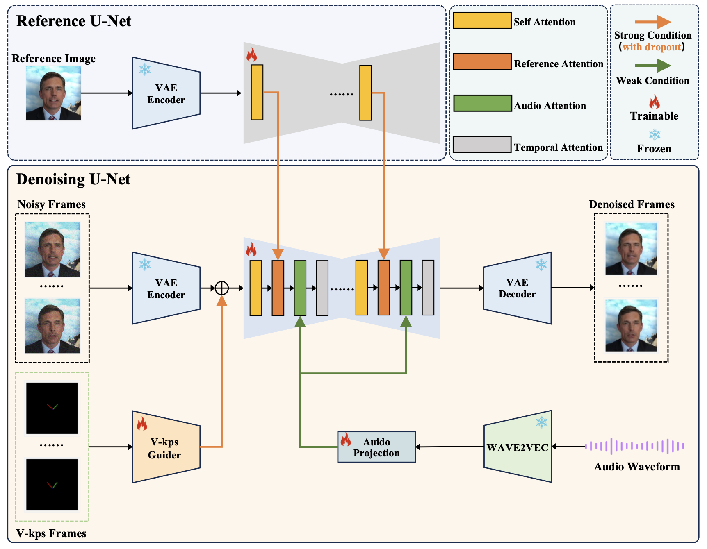
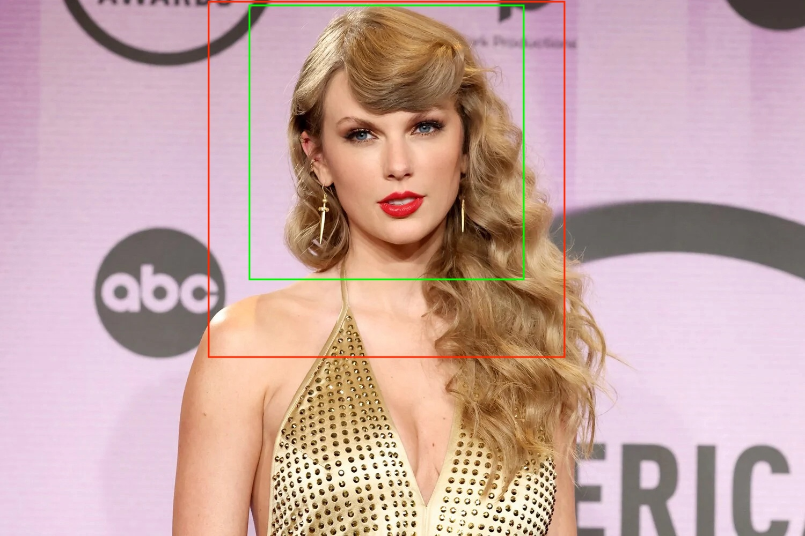

# **_V-Express: Conditional Dropout for Progressive Training of Portrait Video Generation_**

<a href='https://tenvence.github.io/p/v-express/'></a>
<a href='https://tenvence.github.io/p/v-express/'></a>
<a href='https://huggingface.co/tk93/V-Express'></a>

<!-- [](https://github.com/tencent-ailab/IP-Adapter/) -->

---

## Introduction

In the field of portrait video generation, the use of single images to generate portrait videos has become increasingly prevalent.
A common approach involves leveraging generative models to enhance adapters for controlled generation.
However, control signals can vary in strength, including text, audio, image reference, pose, depth map, etc.
Among these, weaker conditions often struggle to be effective due to interference from stronger conditions, posing a challenge in balancing these conditions.
In our work on portrait video generation, we identified audio signals as particularly weak, often overshadowed by stronger signals such as pose and original image.
However, direct training with weak signals often leads to difficulties in convergence.
To address this, we propose V-Express, a simple method that balances different control signals through a series of progressive drop operations.
Our method gradually enables effective control by weak conditions, thereby achieving generation capabilities that simultaneously take into account pose, input image, and audio.



## Release

- [2024/05/29] 🔥 We have added video post-processing that can effectively mitigate the flicker problem.
- [2024/05/23] 🔥 We release the code and models.

## Installation

```
# install requirements
pip install diffusers==0.24.0
pip install imageio-ffmpeg==0.4.9
pip install insightface==0.7.3
pip install omegaconf==2.2.3
pip install onnxruntime==1.16.3
pip install safetensors==0.4.2
pip install torch==2.0.1
pip install torchaudio==2.0.2
pip install torchvision==0.15.2
pip install transformers==4.30.2
pip install einops==0.4.1
pip install tqdm==4.66.1

# download the codes
git clone https://github.com/tencent-ailab/V-Express

# download the models
cd V-Express
git lfs install
git clone https://huggingface.co/tk93/V-Express
mv V-Express/model_ckpts model_ckpts

# then you can use the scripts
```

## Download Models

you can download models from [here](https://huggingface.co/tk93/V-Express). We have included all the required models in the model card. You can also download the models separately from the original repository.

- [stabilityai/sd-vae-ft-mse](https://huggingface.co/stabilityai/sd-vae-ft-mse).
- [runwayml/stable-diffusion-v1-5](https://huggingface.co/runwayml/stable-diffusion-v1-5). Only the model configuration file for unet is needed here.
- [facebook/wav2vec2-base-960h](https://huggingface.co/facebook/wav2vec2-base-960h).
- [insightface/buffalo_l](https://github.com/deepinsight/insightface/releases/download/v0.7/buffalo_l.zip).

## How to Use

### <span style="color:red">Important Reminder</span>

**_Important! Important!! Important!!!_**

In the talking-face generation task, when the target video is not the same person as the reference character, the retarget of the face will be a <span style="color:red">very important</span> part. And choosing a target video that is more similar to the pose of the reference face will be able to get better results. In addition, our model now performs better on English, and other languages have not yet been tested in detail.

### Run the demo (step1, _optional_)

If you have a target talking video, you can follow the script below to extract the audio and face V-kps sequences from the video. You can also skip this step and run the script in Step 2 directly to try the example we provided.

```shell
python scripts/extract_kps_sequence_and_audio.py \
    --video_path "./test_samples/short_case/10/gt.mp4" \
    --kps_sequence_save_path "./test_samples/short_case/10/kps.pth" \
    --audio_save_path "./test_samples/short_case/10/aud.mp3"
```

We recommend cropping a clear square face image as in the example below and making sure the resolution is no lower than 512x512. The green to red boxes in the image below are the recommended cropping ranges.



### Run the demo (step2, _core_)

**Scenario 1 (A's picture and A's talking video.) (Best Practice)**

If you have a picture of A and a talking video of A in another scene. Then you should run the following script. Our model is able to generate speaking videos that are consistent with the given video. _Here we only provide some gif results. You can see more examples with audio on our [project page](https://tenvence.github.io/p/v-express/)._

```shell
python inference.py \
    --reference_image_path "./test_samples/short_case/10/ref.jpg" \
    --audio_path "./test_samples/short_case/10/aud.mp3" \
    --kps_path "./test_samples/short_case/10/kps.pth" \
    --output_path "./output/short_case/talk_10_no_retarget.mp4" \
    --retarget_strategy "no_retarget" \
    --num_inference_steps 30
```


**Scenario 2 (A's picture and any talking audio.)**

If you only have a picture and any talking audio. With the following script, our model can generate vivid mouth movements for fixed faces.

```shell
python inference.py \
    --reference_image_path "./test_samples/short_case/tys/ref.jpg" \
    --audio_path "./test_samples/short_case/tys/aud.mp3" \
    --kps_path "./test_samples/short_case/tys/kps.pth" \
    --output_path "./output/short_case/talk_tys_fix_face.mp4" \
    --retarget_strategy "fix_face" \
    --num_inference_steps 30
```


**Scenario 3 (A's picture and B's talking video.)**

- With the script below, our model generates vivid mouth movements accompanied by slight facial motion.

```shell
python inference.py \
    --reference_image_path "./test_samples/short_case/tys/ref.jpg" \
    --audio_path "./test_samples/short_case/tys/aud.mp3" \
    --kps_path "./test_samples/short_case/tys/kps.pth" \
    --output_path "./output/short_case/talk_tys_offset_retarget.mp4" \
    --retarget_strategy "offset_retarget" \
    --num_inference_steps 30
```


- With the following script, our model generates a video with the same movements as the target video, and the character's lip-synching matches the target audio.

> [!NOTE]
> We have only implemented the very naive retarget strategy so far, which allows us to achieve driving the reference face with different character videos under limited conditions. To get better results, we strongly recommend you to choose a target video that is closer to the reference face. We are also trying to implement a more robust face retargeting strategy, which hopefully can further solve the problem of inconsistency between the reference face and the target face. We also welcome experienced people who can help.

```shell
python inference.py \
    --reference_image_path "./test_samples/short_case/tys/ref.jpg" \
    --audio_path "./test_samples/short_case/tys/aud.mp3" \
    --kps_path "./test_samples/short_case/tys/kps.pth" \
    --output_path "./output/short_case/talk_tys_naive_retarget.mp4" \
    --retarget_strategy "naive_retarget" \
    --num_inference_steps 30
```


### More parameters

For different types of input condition, such as reference image and target audio, we provide parameters for adjusting the role played by that condition information in the model prediction. We refer to these two parameters as `reference_attention_weight` and `audio_attention_weight`. Different parameters can be applied to achieve different effects using the following script. `Through our experiments, we suggest that reference_attention_weight takes the value 0.9-1.0 and audio_attention_weight takes the value 1.0-3.0.`

```shell
python inference.py \
    --reference_image_path "./test_samples/short_case/10/ref.jpg" \
    --audio_path "./test_samples/short_case/10/aud.mp3" \
    --kps_path "./test_samples/short_case/10/kps.pth" \
    --output_path "./output/short_case/talk_10_fix_face_with_weight.mp4" \
    --retarget_strategy "fix_face" \
    --reference_attention_weight 0.95 \
    --audio_attention_weight 3.0
```

We show the different effects produced by different parameters in the following video. You can adjust the parameters accordingly to your needs.


## Acknowledgements

We would like to thank the contributors to the [magic-animate](https://github.com/magic-research/magic-animate), [AnimateDiff](https://github.com/guoyww/AnimateDiff), [sd-webui-controlnet](https://github.com/Mikubill/sd-webui-controlnet/discussions/1236), and [Moore-AnimateAnyone](https://github.com/MooreThreads/Moore-AnimateAnyone) repositories, for their open research and exploration.

The code of V-Express is released for both academic and commercial usage. However, both manual-downloading and auto-downloading models from V-Express are for non-commercial research purposes. Our released checkpoints are also for research purposes only. Users are granted the freedom to create videos using this tool, but they are obligated to comply with local laws and utilize it responsibly. The developers will not assume any responsibility for potential misuse by users.

## Citation

If you find V-Express useful for your research and applications, please cite using this BibTeX:

```bibtex
@article{wang2024V-Express,
  title={V-Express: Conditional Dropout for Progressive Training of Portrait Video Generation},
  author={Wang, Cong and Tian, Kuan and Zhang, Jun and Guan, Yonghang and Luo, Feng and Shen, Fei and Jiang, Zhiwei and Gu, Qing and Han, Xiao and Yang, Wei},
  booktitle={arXiv preprint arxiv: comming soon},
  year={2024}
}
```
